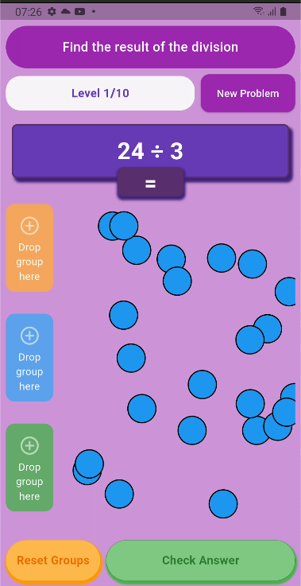

# Marble Game



A modern Flutter project for a marble grouping game.

## Features

- 🎮 Interactive marble grouping gameplay
- 🧩 Clean architecture using GetX for state management and routing
- 🛠️ Linting and testing integrated (see [CI workflow](.github/workflows/marble_game.yml))
- 📱 Cross-platform: Android, iOS, Web, Desktop

## Getting Started

### Prerequisites

- [Flutter SDK](https://docs.flutter.dev/get-started/install) (version 3.8.1+)
- Dart SDK (compatible with Flutter version)
- A device or emulator

### Installation

```bash
git clone https://github.com/your-username/marble_game_flutter.git
cd marble_game_flutter
flutter pub get
```

### Running the App

```bash
flutter run
```

### Running Tests

```bash
flutter test
```

## Project Structure

- `lib/` - Main source code
- `screenshots/` - App screenshots
- `.github/workflows/` - CI/CD configuration

## Contributing

Contributions are welcome! Please open issues or submit pull requests.

## License

This project is licensed under the MIT License.
